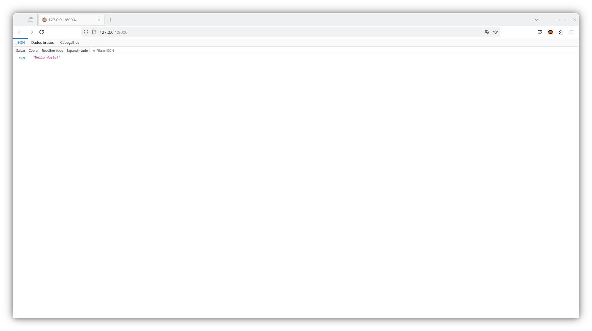

# FastAPI and SQLModel

## ✨ About this project

A ready-to-use starter template for building web applications with the [FastAPI](https://fastapi.tiangolo.com/) framework and [SQLModel](https://sqlmodel.tiangolo.com/) - structured, clean, and easy to extend.

## 🛠 Technologies used

## 👨‍💻 Author

Crafted with 💙 by Renato Cruz. Got questions or feedback? Reach out anytime!

What I'm listening to while I code or study 😎🎵:

## 💝 Support this project

Your donation keeps this project alive and helps me continue creating and sharing useful content.

### GitHub Sponsors

[https://github.com/sponsors/natorsc/](https://github.com/sponsors/natorsc/)

### Pix (Brazil)

`b1839493-2afe-484d-9272-82a3e402b36f`

---

## 💡 Extra

- [FastAPI](https://fastapi.tiangolo.com/).
- [SQLModel](https://sqlmodel.tiangolo.com/).
