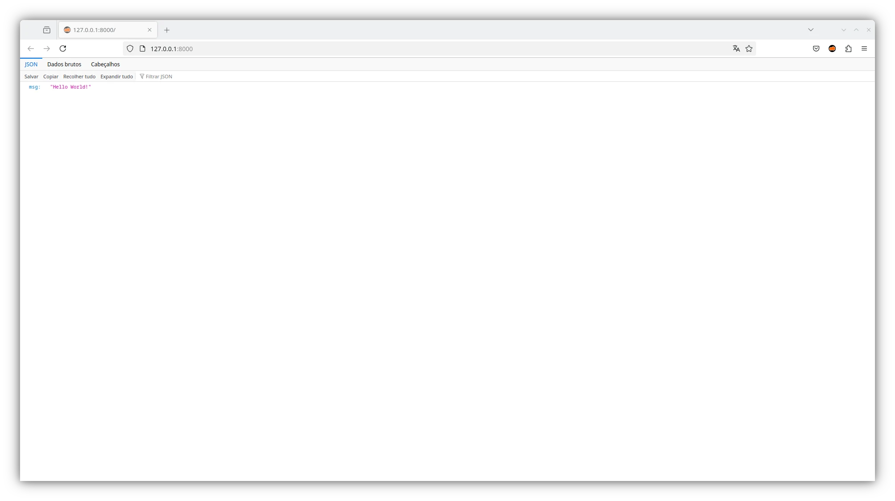

# FastAPI

Initial template for projects with the [FastAPI](https://github.com/fastapi/fastapi) framework.

**Done**:

- [x] [uv](https://github.com/astral-sh/uv). An extremely fast Python package and project manager, written in Rust.
- [x] [sqlmodel](https://github.com/fastapi/sqlmodel). SQL databases in Python, designed for simplicity, compatibility, and robustness.
- [x] [Python dotenv](https://github.com/theskumar/python-dotenv). Reads key-value pairs from a .env file and can set them as environment variables. It helps in developing applications following the 12-factor principles.
- [x] [Httpx](https://github.com/encode/httpx/). A next generation HTTP client for Python.
- [x] [pytest](https://github.com/pytest-dev/pytest). The pytest framework makes it easy to write small tests, yet scales to support complex functional testing.
- [x] [Ruff](https://github.com/astral-sh/ruff). An extremely fast Python linter and code formatter, written in Rust. 
- [x] [Taskipy](https://github.com/taskipy/taskipy). the complementary task runner for python 
